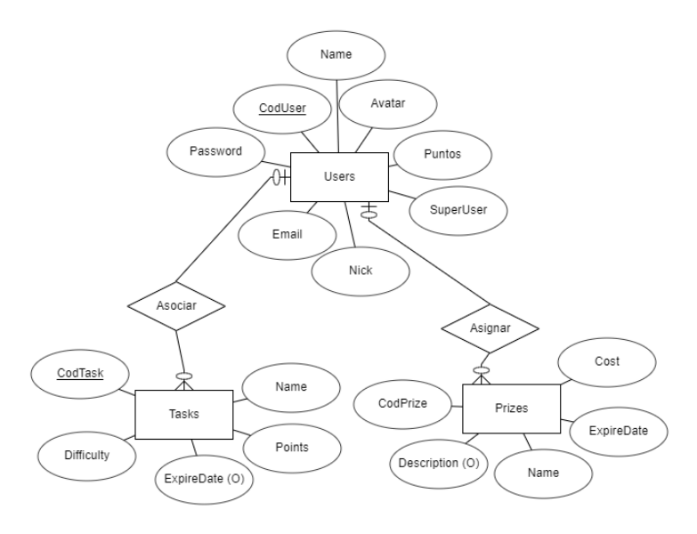

<h3 align="center">Task4Home</h3>

### ¿Qué es Task4Home? 📋

Una aplicación que consiste en gestionar tareas domésticas y al realizarlas consigues unos puntos que son canjeables por premios, todo esto en un grupo de usuarios que conviven en la misma casa o trabajo, el objetivo final de la aplicación es que se realizen de forma ordenada las tareas que son obligatorias pero a nadie le gusta hacer.

##Esto es una maquetación realizada en IONIC de la aplicación, puede someterse a cambios considerables de diseño y funcionabilidad##

### Estructura 📋

_Aplicación Android_
- Base de datos en la nube (FIRESTORE)

### Funcionamiento🔧

_--[Video explicativo]()--_

### APK ###

[APK](https://github.com/jairobuendia/ProyectoFinalTask4Home/blob/main/Task4Home-v1/app/app-debug.apk)
