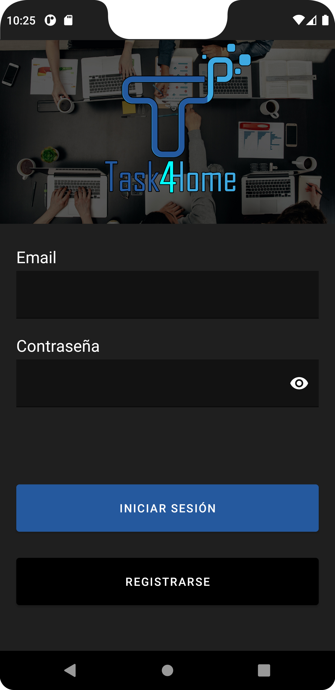
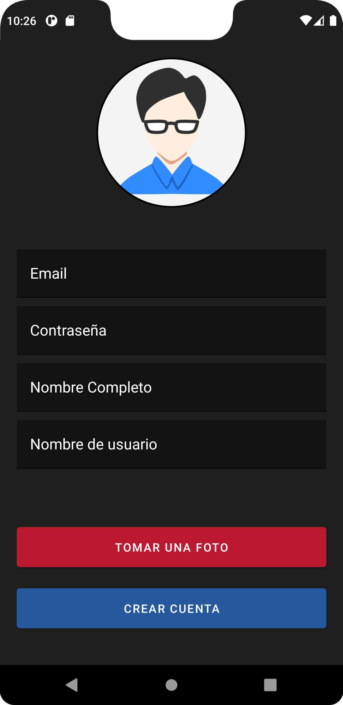
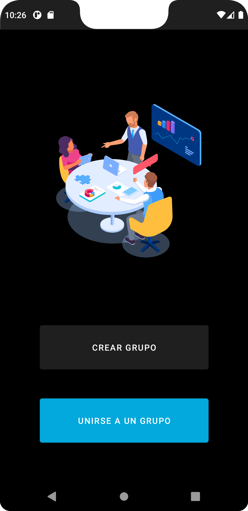
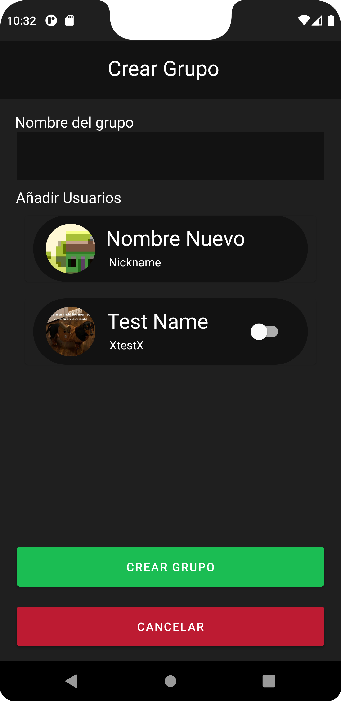
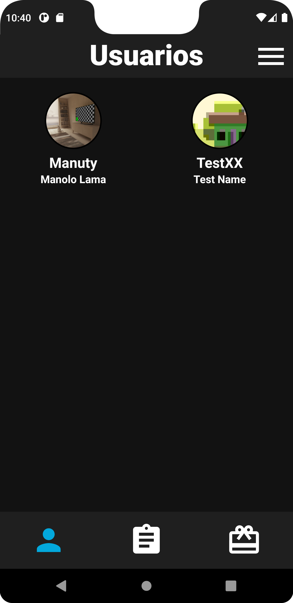
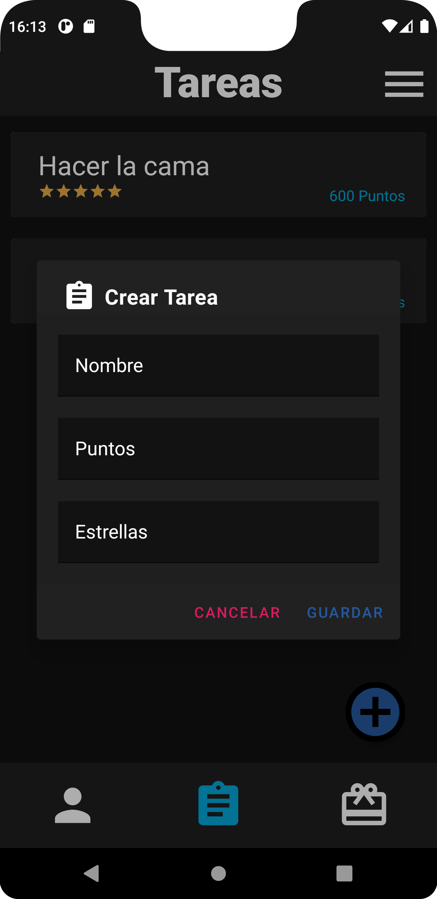
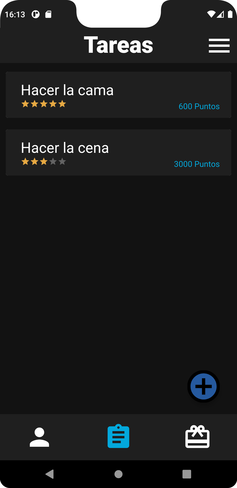
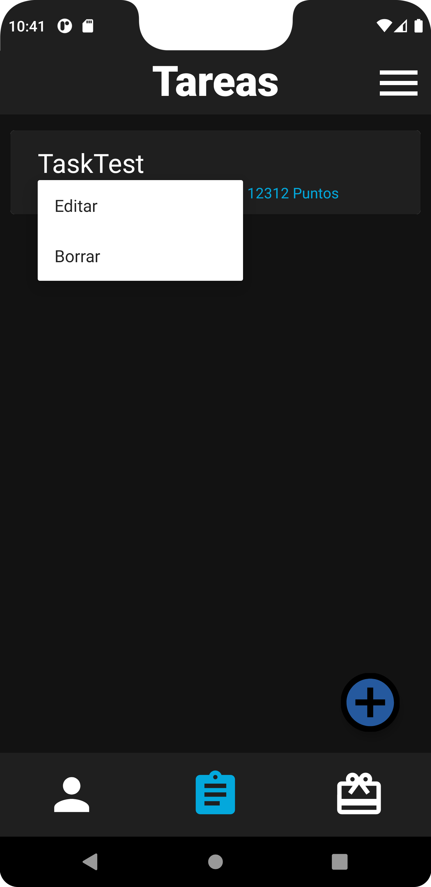
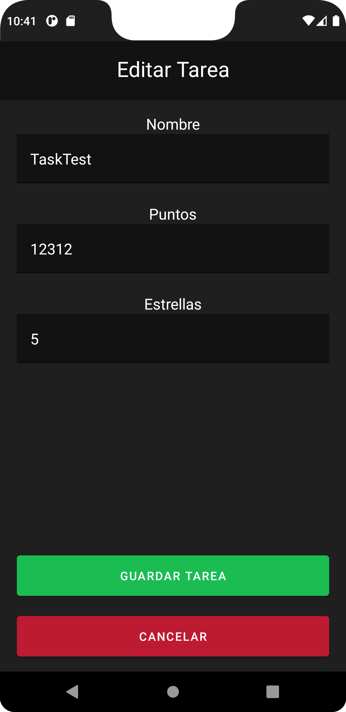

    

 

## 📋 &nbsp;¿Qué es Task4Home?

Una aplicación realizada en Android/Kotlin que consiste en gestionar tareas domésticas dentro de un grupo de usuarios que conviven en la misma casa o trabajo, el objetivo final de la aplicación es que se realizen de forma ordenada las tareas que son obligatorias pero a nadie le gusta hacer.

 &nbsp;&nbsp;&nbsp;&nbsp; 

## 🔧 &nbsp;Funcionamiento
<h3>Login y register</h3>

    &nbsp;&nbsp;&nbsp;&nbsp;
    

 
<h3>Página principal y creación de grupo</h3>

    &nbsp;&nbsp;&nbsp;&nbsp;
    

 
<h3>Usuarios del grupo</h3>

 
<h3>Tareas del grupo y creación de tareas</h3>

    &nbsp;&nbsp;&nbsp;&nbsp;
    

 
<h3>Editar tarea</h3>

    &nbsp;&nbsp;&nbsp;&nbsp;
    

## :exclamation: &nbsp;Descargar APK
:boom:[AQUÍ](https://github.com/jairobuendia/ProyectoFinalTask4Home/blob/main/app-debug.apk):boom:
 
## :pager: &nbsp;Presentación
[LINK](https://github.com/jairobuendia/ProyectoFinalTask4Home)&nbsp;:bulb:
 
## :books: &nbsp;Bibliografía
:point_right:&nbsp;[Android](https://developer.android.com/)
 
:point_right:&nbsp;[Firebase](https://firebase.google.com/docs)
 
:point_right:&nbsp;[YoutubeMoureDev](https://www.youtube.com/c/MouredevApps)
 
:point_right:&nbsp;[Youtube](https://www.youtube.com/results?search_query=firebase+recyclerview+android+studio)
 
:point_right:&nbsp;[StackOverlow](https://stackoverflow.com/)
 
## :movie_camera: &nbsp;Vídeo explicativo

